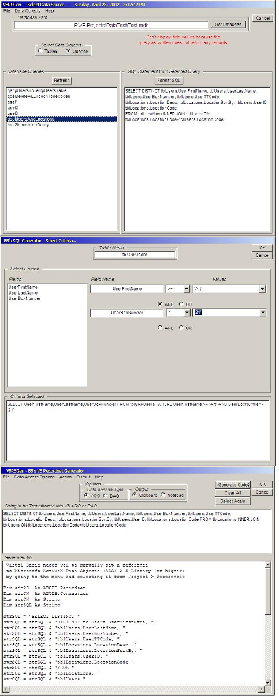



## VBRSGen

### Description

VBRSGen is a handy VB 6.0 Add-In that creates formatted ADO/DAO recordset and SQL code from Access database tables and queries. Generates variables, sets objects, etc. Also includes a simple "Where" clause creator tool and a results preview grid. Code is ready to paste from the Clipboard or Notepad.

Some SQL statements aren't parsed properly, but these can be easily edited; this still saves a lot of time in repetitive ADO/DAO database coding.

I'm making this available elsewhere as shareware for $20, but because the PSC community has provided so much invaluable support and helpful code, feel free to download the open source code here for your own personal use at no charge!

This was originally posted in early April 2002 and received amazing feedback and dozens of "5-Globe" votes, until the PSC database had some problems. So please vote and leave feedback to let me know what you think!
 
### More Info
 
Some SQL statements aren't parsed properly, but these can be easily edited; this still saves a lot of time in repetitive ADO/DAO database coding.

I'm making this available elsewhere as shareware for $20, but because the PSC community has provided so much invaluable support and helpful code, feel free to download the open source code here for your own personal use at no charge!

This was originally posted in early April 2002 and received amazing feedback and dozens of "5-Globe" votes, until the PSC database had some problems. So please vote and leave feedback to let me know what you think!

             |
---                |---
**Submitted On**   |2002-04-28 14:14:50
**By**             |[Brian Battles WS1O](https://github.com/Planet-Source-Code/PSCIndex/blob/master/ByAuthor/brian-battles-ws1o.md)
**Level**          |Intermediate
**User Rating**    |5.0 (323 globes from 65 users)
**Compatibility**  |VB 5\.0
**Category**       |[Databases/ Data Access/ DAO/ ADO](https://github.com/Planet-Source-Code/PSCIndex/blob/master/ByCategory/databases-data-access-dao-ado__1-6.md)
**World**          |[Visual Basic](https://github.com/Planet-Source-Code/PSCIndex/blob/master/ByWorld/visual-basic.md)
**Archive File**   |[VBRSGen775774302002\.zip](https://github.com/Planet-Source-Code/brian-battles-ws1o-vbrsgen__1-33690/archive/master.zip)

